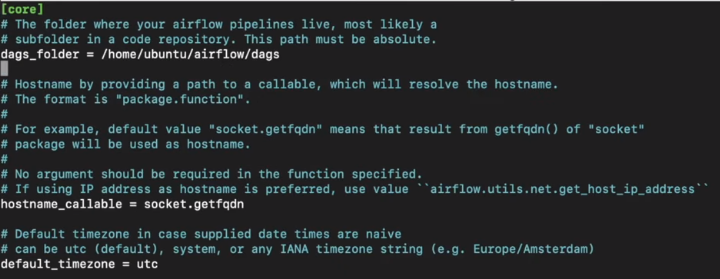

# Daily Financial News Update with Airflow as the Workflow Management Tool

## Project Description

The main idea of the project is to get daily news update related to Finance. We are using Free Trial API of Yahoo Finance and also using Airflow for Orchestrating our Data Pipelines.

## Instructions

1. **Clone the Repository:** Start by cloning the repository from the following link: [yfinance_etl repository](https://github.com/abdurafeyf/yfinance_etl).

2. **Subscribe to Yahoo Finance API:** Visit the following URL and subscribe to the free version of the API: [Yahoo Finance API](https://rapidapi.com/apidojo/api/yahoo-finance1). Ensure that you securely store your API key for later use.

3. **Update API Key:** After cloning the repository, update the API Key in the **yfinance_etl.py** file.

4. **Set Up Cloud Environment:** Choose a Cloud Service Provider (GCP or AWS); in our case, we used Google Cloud Platform. Create an account and proceed to create an EC2 instance (AWS) or a VM (GCP). You may select an instance size (micro or medium) as it will not be handling a massive number of requests. After creating the instance, connect to it using SSH, either through **SSH-in-browser** or your own **Terminal**. Once connected, run the following commands:

- sudo apt-get update
- sudo apt install python3-pip
- sudo pip install apache-airflow
- sudo pip install pandas
- sudo pip install google-api-python-client
- sudo pip install google-cloud-storage

5. **Verify Airflow Installation:** After executing the above commands, run the following command to verify that Airflow is installed correctly: "**airflow**."

6. **Configure Airflow:** Before starting Airflow, ensure that you make the necessary configuration changes. Follow these steps:

- Navigate to the Airflow directory with: `cd airflow/`
- Edit the configuration file with: `sudo nano airflow.cfg`

You will encounter a configuration file resembling this: .

Replace the line *dags_folder = /home/ubuntu/airflow/dags* with *dags_folder = /home/ubuntu/airflow/yfinance_dags* in the configuration file. Save the file by pressing **Ctrl+X**, then **Y**, and finally **Enter**.

Create a new directory with the command "**mkdir yfinance_dags**."

Within the newly created directory, generate three new files: "yfinance_etl.py," "yfinance_dag.py," and "service-key.json." To obtain the content for these files, use the **sudo nano** command. Paste the respective contents into each file.

After completing this step, run **ariflow standalone**, and your Airflow instance will be up and running at http://YOUR_EXTERNAL_URL:8080. The password and admin details will be displayed in your terminal after executing the "airflow standalone" command.

## Resources

1. **API:** [Yahoo Finance API](https://rapidapi.com/apidojo/api/yahoo-finance1)
2. **Twitter Data Pipeline by Darshil Parmar:** [YouTube Link](https://www.youtube.com/watch?v=q8q3OFFfY6c)
3. **Quick Guide on Setting Up Airflow on GCP:** [hevodata.com Guide](https://hevodata.com/learn/google-airflow/)
